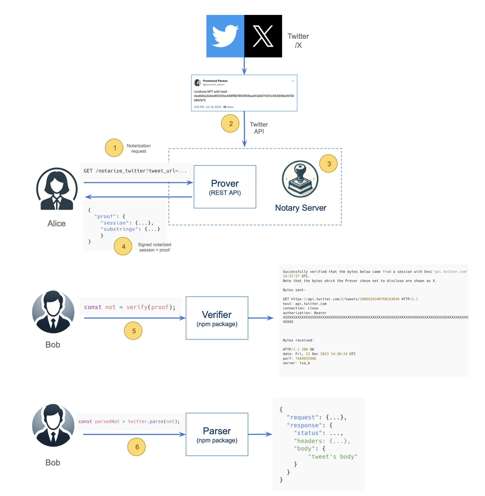
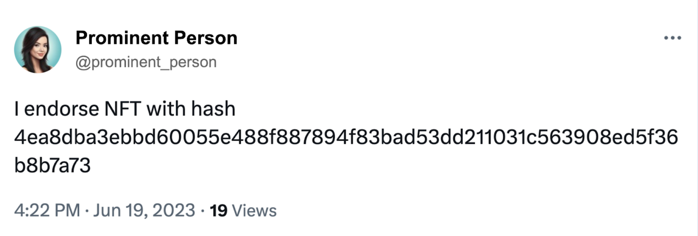

# zkNotary: a zkOracle for Mina powered by TLSNotary

**Note to Users**: Our project, zkNotary, is extensive, spanning multiple directories, each meticulously documented to aid your understanding and usage. For your convenience and a seamless navigation experience, we highly recommend visiting our comprehensive documentation hosted on Gitbook. There, you'll find an organized, user-friendly guide tailored to help you navigate through every aspect of zkNotary with ease.

**Note to Developers**: For some reason, the [web app](https://github.com/vixuslabs/zkNotary/tree/main/o1js/app/zknotary) is not working in production. Specifically, inside of the `verify.transcript.tsx` foudn [here](https://github.com/vixuslabs/zkNotary/blob/main/o1js/app/zknotary/src/components/mina/verify-transcript.tsx) the `signature.verify(...)` function always returns a `false` value. The reason is currently unknown, but we suspect that it has to do with how our monorepo is being built and causes it to corrupt the `@zknotary/contracts` [package](https://github.com/vixuslabs/zkNotary/tree/main/o1js/contracts/contracts). So currently what you can do is clone the repo and run it locally. [Go to](#run-the-web-app-locally) the bottom of this README to see how.

📖 Explore the zkNotary Documentation: [zkNotary Documentation on Gitbook](https://zknotary.gitbook.io/zknotary/)

## Introduction

In today's Internet, private data from HTTPS-based REST APIs can be securely accessed thanks to technologies like TLS. However, proving the origin of such data to third parties is still a significant challenge. This limitation confines the value of the data to its original source, preventing it from being exported to other applications with preserved integrity.

This is where the open source project [TLSNotary](https://tlsnotary.org) provides an elegant solution by dividing TLS session keys between the TLS client and a Notary, through a two-party computation (2PC).

We propose zkNotary, a zkOracle for Mina based on TLSNotary as its core component. zkNotary will enable anyone to create cryptographic proofs of authenticity that prove that some data accessed via TLS genuinely originated from a specific REST API, providing the Mina community with a powerful cryptographic primitive that will open the door to countless applications in the ZK space.

## Problem statement

Currently, there is no oracle solution for Mina that can retrieve data from an HTTPS server while providing all of the following properties:

1. Data provenance verification
2. Data integrity guarantee
3. Data privacy preservation
4. No trust assumptions
5. No server-side modifications

While working on my zkIgnite Cohort 1 project, ["Cryptographic Proof of NFT Endorsement" (CPoNE)](https://github.com/racampos/cpone), I realized that my project heavily relied on a trustless method for data retrieval. Specifically, I needed to retrieve data from the Twitter API to feed into a Mina zkApp, which would verify that the data retrieved from Twitter matched a set of previously committed data, i.e., a Twitter handle and specific NFT metadata.

After spending several weeks studying the theory behind TLS and current attempts at solving this problem, I realized that this was a substantial undertaking. Consequently, I decided to defer the development of a truly trustless zkOracle for a future cohort.

Like me, many zkApp developers are trying to develop applications that rely on trusted data from external sources. Without a reliable zkOracle to facilitate this, the data fed into their zkApps would lack a solid foundation of authenticity. This is similar to how my CPoNE project lacks authenticity due to the inability to prove, in a trustless way, that the data was retrieved from Twitter.

A solution to this problem would provide the Mina community of zkApp developers with a highly useful and needed cryptographic primitive. This will enable them to create zk applications that use data from the outside world in a private and trustless manner.

## Solution

Solutions to this problem have already been proposed and implemented by projects such as [TLSNotary](https://tlsnotary.org) and [DECO](https://www.deco.works). Both of these projects use the same approach, which consists of splitting the client's TLS session keys between two parties, a User and a Notary, through secure two-party computation (2PC). During the protocol, neither the User nor the Notary possess the full TLS session keys; instead, they each hold a share of those keys. This arrangement makes it impossible for the User to forge any data.

Since TLSNotary is an open-source project, zkNotary focuses on using it as its core component. We aimed to create a user-friendly layer specially designed for Mina zkApp developers, making it simple to add a zkOracle to any zkApp architecture.

Given the limited timeframe (three months) available for the development of this project, we have constrained zkNotary's scope to retrieving and authenticating data from RESTful APIs only, not generic websites. While this approach is somewhat limiting, we believe it addresses the needs of most zkApp developers.

Our goal has been to provide the Mina community with an easy-to-use building block that can be incorporated into any zkApp architecture, without the need for developers to understand the complexities of the TLS protocol or the inner workings of TLSNotary.

## A TLSNotary Primer

In order to understand zkNotary's architecture and design choices, it's important to first understand the basics of how TLSNotary works. Following is a quick overview of the most important aspects.

### TLS 101

The TLS protocol allows an HTTP client (Alice) to exchange data securely with a web server. TLS does this by providing data privacy and data integrity to the communication between Alice and the server. Data privacy means that the data is encrypted and only Alice is able to decrypt it. Data integrity means that Alice can be certain that the data has not been tampered with.


### The Data Portability Problem

Now let's see what happens when Alice needs to share the data she retrieved from the web server with a third party (Bob). In this case, Bob can't use the data without having to trust that Alice didn't modify it. This can be summarized as the data not being "portable".


The reason for this lack of portability is simple: the encryption and signing keys from the TLS session between Alice and the web server are shared keys, which means that they are the same for both Alice and the server. So, if Alice knows the keys, nothing prevents her from changing the data and then re-signing it before forwarding it to Bob.

### TLSNotary to the Rescue

TLSNotary was introduced to solve this portability problem. If only we could, somehow, prevent Alice from having access to the TLS session keys, she would not be able to tamper with the data and Bob would be certain of the data's integrity. This is exactly what TLSNotary does, thus making the data portable.


### TLSNotary's Secret Sauce

But, how exactly does TLSNotary prevent Alice from having access to the keys? After all, being the HTTP client, Alice definitely needs to negotiate the TLS session keys with the server in order to exchange data?

To solve this problem, TLSNotary introduces a novel idea: to bring in a new participant called a "Notary" that, along with Alice, performs the negotiation of the session keys with the server using MultiParty Computation (MPC). This way, neither Alice nor the Notary has the whole keys, but only a share of them, thus preventing Alice from signing the data herself.


### TLSNotary Features

- #### No need for cooperation from the web server

  Because everything happens on the client side, from the web server's point of view, the interaction with the Alice-Notary bundle is no different from an interaction with any other standard HTTP client. This means that TLSNotary doesn't require the web server to cooperate in any way.

- #### Selective Disclosure

  Alice can redact part of the data before sending it to Bob, so that she doesn't disclose sensitive information.

- #### General-purpose Notary Server

  The Notary never learns anything about the data that's being notarized, not even the web server's identity. This allows the Notary to be run as a general-purpose server, to be used by anyone who needs to notarize data to make it portable.

### TLSNotary's Trust Assumptions

Even though Bob doesn't need to trust Alice anymore, he does need to trust the Notary. This is because there's the possibility of the Notary colluding with Alice in order to modify the data and mislead Bob into accepting it as original.

There are some ways to minimize this trust assumption. For example, given that the Notary is a general-purpose server, Bob could require notarizations from serveral independent Notaries before accepting the data as valid. Another possibility is for Bob to act as the Notary by running the notary server software himself. This would eliminate all trust assumptions.

### Learn More

For more information on the TLSNotary project, here are some useful resources:

1. [TLSNotary's website](https://tlsnotary.org)
2. [EthGlobal New York Introductory Video](https://www.youtube.com/watch?v=lHNqJel5uIQ)
3. [TLSNotary Discord Server](https://discord.gg/9XwESXtcN7)
4. [TLSNotary Github](https://github.com/tlsnotary)
5. [TLSNotary Documentation](https://docs.tlsnotary.org)

## Implementation

The project is divided into four main components. Each component used to have its own independent Github repository, but now all live in the same one as a [monorepo](https://en.wikipedia.org/wiki/Monorepo).

### 1. The Prover

This component lies at the core of zkNotary and is responsible for conducting the multiparty computation with the Notary. This collaboration establishes an MPC TLS session with the web server and generates the session notarization along with the corresponding proof.

Implemented as a REST API written in Rust (mirroring the language used in TLSNotary), this API offers a range of endpoints, each corresponding to a different service (such as Twitter, Discord, etc.). The rationale for adopting a REST API approach is to simplify the zkApp developer's experience by obviating the need to deal with the complexities of compiling and running Rust code.

The complete source code and documentation for this component are available in the [`provers` directory](./provers).

### 2. The Verifier

This component plays a crucial role in the verification process of the notarization proof generated by TLSNotary, specifically tailored for integration within a JavaScript application.

Originally authored in Rust, this code has undergone compilation into Web Assembly. This transformation facilitated the creation of an NPM package, leveraging the [wasm-pack](https://rustwasm.github.io/docs/wasm-pack/introduction.html) project. Consequently, it can be seamlessly incorporated into any JavaScript application. The package, named zknotary-verifier, is readily available on the NPM Registry.

For comprehensive information and access to the complete source code, refer to the [`verifier` directory](./verifier).

### 3. The Parser

This component is equipped with a suite of utilities designed to assist developers in accurately parsing the output from the verifier component.

When the proof is verified as valid, the output from the verifier comprises the original notarization of the TLS session, as generated by TLSNotary. This notarization typically consists of unstructured text, the nature of which varies considerably based on the type of data initially notarized. To streamline the process for developers in handling the verifier's output, we have developed a series of application-specific parsers.

Currently, the parser specifically for Twitter is available. Plans are in place to extend this suite with additional parsers for other services, including Facebook, Reddit, and more.

The complete source code and documentation for this component can be found in the [`parsers` directory](./parsers).

### 4. The AWS deployment utility

The Prover's functionality depends on the operation of a Notary Server, which must be active and accessible. For development purposes, developers can simply clone the [TLSNotary Github repo](https://github.com/tlsnotary/tlsn), then build and run the Notary Server locally. However, for a production environment, the Notary Server needs to be deployed on public infrastructure that the Prover can reach.

To facilitate this deployment on AWS for zkApp developers, we have included a deployment script written in JavaScript. This script automates several key tasks necessary for setting up a server on AWS. It includes creating an EC2 instance using a Linux image, installing Rust, cloning the TLSNotary GitHub repository, building, and then running the Notary Server. This utility streamlines the deployment process, making it more straightforward and accessible for developers looking to deploy their applications in a production environment.

## General Architecture

In order to better understand the overall architecture of the project, we have designed the following diagram, which illustrates the flow and interrelationships between the different components. We use Twitter as an example, but the workflow is the same with any other service:



Here is a breakdown of each of the steps involved in the process:

- **Step 1**: Alice calls the zkNotary Prover REST API with the tweet's URL as a querystring argument.

  ```
  GET /notarize_twitter?tweet_url=https://twitter.com/mathy782/status/1670919907687505920
  ```

  This is the tweet that is being notarized for this example:

  

- **Step 2**: The zkNotary Prover and the Notary Server use MPC to create a joint TLS session with the Twitter API and retrieve the tweet's data.

- **Step 3**: After closing the TLS session with Twitter, the Notary Server executes the notarization of the TLS session and signs it with its private key.

- **Step 4**: The Prover REST API replies to Alice with a JSON object containing the signed notarization of the TLS session with the Twitter server as well as the corresponding proof generated by the Notary Server.

- **Step 5**: Alice sends the signed notarized session and the proof to Bob. In order to verify it by himself, he uses the `verify()` function from the [`zknotary-verifier`](./verifier) npm package. This function takes as input the proof and the Notary Server's public key and returns a plain text file containing the transcript from the TLS session.

  **Note**: Given that the verifier's output is a plain text file, in order for Bob to make sense of it and extract the important information (in our example, the tweet's text), he needs to parse it. But because the contents of the transcript vary substantially depending on their source (Twitter, Reddit, Discord, etc) we have decided to write a set of [utility functions](./parsers) that correctly parse the verifier's output, given its source.

- Step 6: Bob uses the `twitter.parse()` function from the [`zknotary-parsers`](./parsers) npm package to parse the plain text file and receive in return a structured JSON object from which he can easily extract the important information, i.e, the tweet's data:

  ```json
  {
    "request": { },
    "response":
      "status": "...",
      "headers": { },
      "body": {
            "data": {
              "edit_history_tweet_ids": [
                "1686626240768163840"
              ],
              "id": "1686626240768163840",
              "text": "I endorse this NFT: 0f1a6f87599424233134e77a0214f9ebe2a2a7da73ed3025801412ff34e3ae2a"
            }
          }
  }
  ```

## Setup & Usage

Please refer to the README files for each of the Prover, Verifier and Parser subdirectories for detailed instructions on usage:

1. [Prover](./provers/README.md)
2. [Verifier](./verifier/README.md)
3. [Parsers](./parsers/README.md)
4. [AWS Deployment Script](./aws/README.md)


## Run the web app locally

Our web app has two examples:
- Github: Fetching all of a user's commits from a public repository.
- Etherscan: Get a user's ERC-20 token balance from a deployed smart contract.

### Web App
To run the web app locally, you need to have the following installed:
- pnpm: 8.15.*,
- node: >=18.18.0 <19.0.0

Next, run the following commands:

```bash
git clone https://github.com/vixuslabs/zkNotary.git
cd zkNotary
pnpm install
pnpm build:mina
pnpm dev
```
This will start the web app on `localhost:3000`

### Notary Server
If you would like to spin up your own notary server using our forked version of the tlsn notary server, found [here](), you can do so. 

You will need to have `cargo` installed. If you do not, the instructions do so are can be found [here](https://doc.rust-lang.org/cargo/getting-started/installation.html).

To spin up the notary server, run the following commands:

```bash
git clone https://github.com/vixuslabs/tlsn
cd tlsn/notary-server
cargo run --release -- --config-file config/mina-config.yaml
```

Then within this repository, go to `o1js/app/zknotary/src/server/actions`. Then within both `notarize_etherscan.ts` and `notarize_github.ts`, change the value of the `NOTARY_PROVIDER_HOST` by hard coding the value their directly, or add it to the `.env` inside of `o1js/app/zknotary`.

⚠️ Our implementation of notary-server is not meant to be used in production, and is already outdated from tlsn's `tlsn` repository.

### Provers
Last part of the set up is to spin up the [provers](https://github.com/vixuslabs/zkNotary/tree/main/provers). The instructions can be found within the directory.


## License

This project is licensed under the [Apache-2.0](LICENSE) License.
